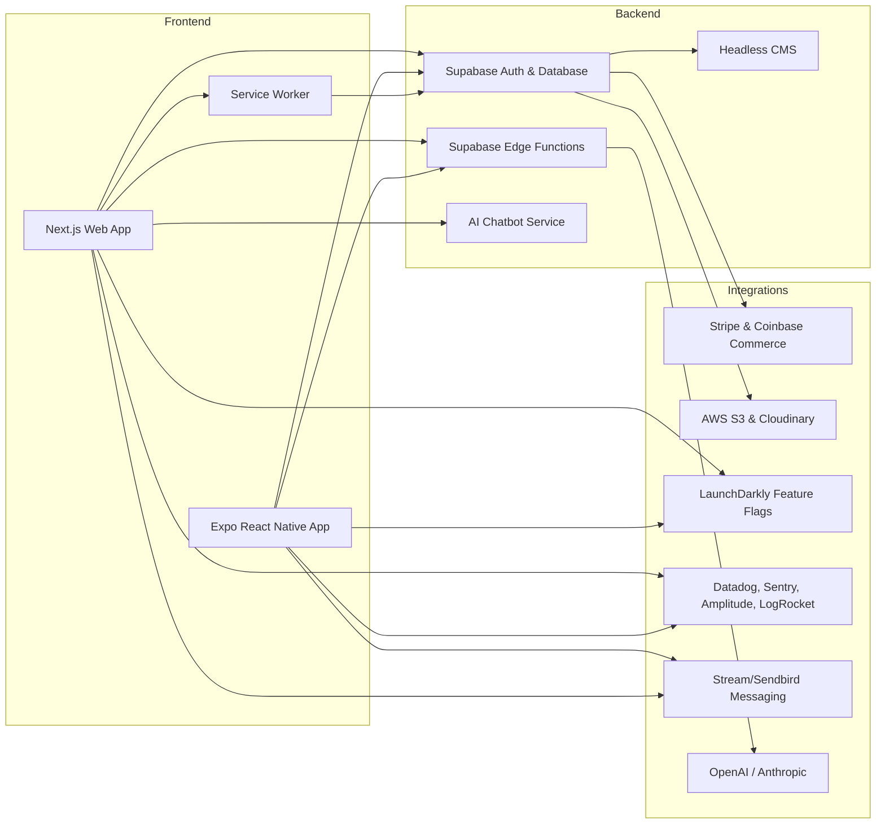

# Architecture & Infrastructure Overview

This document describes the overall system architecture, data flows, deployment topology, security layers, and integration points for the Vibewell platform.

---

## 1. System Components

---

## 2. Data Flow

1. **User Action** (Web/Mobile) triggers API call to **Supabase Auth & Edge Functions**.
2. Edge Functions handle business logic and interact with **PostgreSQL** via **Prisma**.
3. Payments routed to **Stripe** or **Coinbase Commerce**; receipts stored in DB.
4. Media uploads/downloads via **AWS S3**; transforms served by **Cloudinary**.
5. Real-time features via **Supabase Realtime** and **Stream Chat**.
6. AI tasks (skin analysis, recommendations, chatbot) processed by **OpenAI/Anthropic**.
7. Feature flags fetched from **LaunchDarkly** SDK in client and server.
8. Monitoring/analytics events sent to **Datadog**, **Sentry**, **Amplitude**, **LogRocket**.
9. Headless CMS provides marketing content via REST/GraphQL.
10. **Service Worker** caches assets and API responses for offline use; background sync queues actions.

---

## 3. Deployment Topology

* **Web App**: Deployed to Vercel (Serverless functions + Edge Runtime).
* **Mobile App**: Built and deployed via Expo EAS; OTA updates managed by Expo.
* **Infrastructure as Code**: Terraform scripts provisioning AWS S3, supabase resources, Vercel projects.
* **CI/CD**: GitHub Actions pipelines:

  1. Lint, test, build artifacts
  2. Doppler secrets injection
  3. Deploy to staging & production
* **Self-hosted services** (optional): Docker/Kubernetes cluster for custom Edge functions if needed.

---

## 4. Security Layers

* **Cloudflare WAF** in front of all public endpoints.
* **Doppler** for secrets management; env vars injected at runtime.
* **JWT Authentication** via Supabase; tokens stored securely.
* **Row-Level Security** policies on PostgreSQL tables.
* **CSP**, **HSTS**, and secure headers enforced on web app.
* **Input Validation** with Zod on API boundaries.

---

## 5. Integration Points

* **Payments**: Stripe and Coinbase Commerce SDKs in Edge functions.
* **Media**: AWS S3 for storage; Cloudinary for on-the-fly transforms in UI.
* **Chat & Messaging**: Stream Chat client in UI; server-side keys protected.
* **AI**: OpenAI API calls from Edge functions; Anthropic fallback.
* **Feature Flags**: LaunchDarkly client in UI; server SDK in Edge.
* **CMS**: Headless CMS (e.g., Strapi) content fetched via GraphQL.

---

## 6. Scalability Considerations

* **Stateless Edge Functions** scale horizontally on Vercel.
* **Database**: Partitioning and read replicas for high-load tables.
* **Cache**: Redis for session storage and API response caching.
* **CDN**: Cloudflare or Vercel CDN for static assets and images.
* **Micro-Frontends**: Potential split of admin/protocol modules via Module Federation.

---

*This architecture ensures a performant, secure, and highly available platform that can scale to millions of users.* 