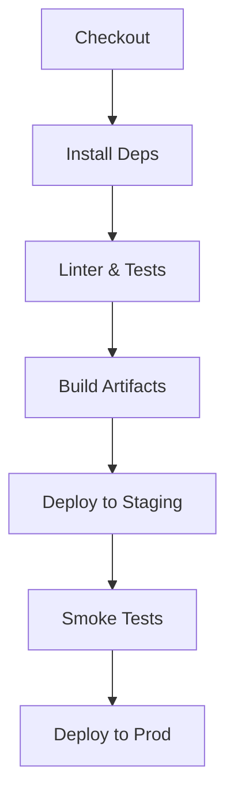

# DevOps & Observability Guide

Guidelines for CI/CD, infrastructure management, monitoring, and incident response.

---

## 1. CI/CD Workflow

* **Pipeline Stages**: Install → Lint & Test → Build → Deploy → Smoke Test.
* **Tools**: GitHub Actions, Docker, Vercel/EAS.
* **Secrets Injection**: Doppler CLI in pipeline.

### 1.1 Pipeline Diagram

---

## 2. Infrastructure as Code

* **Terraform** for AWS resources (S3, CloudFront, IAM).
* **Supabase CLI** for DB migrations.
* **Version Control**: Store state securely, use workspaces for envs.

---

## 3. Monitoring & Logging

* **Metrics (Datadog)**: Track API latency, error rates, resource usage.
* **Error Tracking (Sentry)**: Capture exceptions with context.
* **User Analytics (Amplitude)**: Funnels, retention, feature adoption.
* **Session Replay (LogRocket)**: For UX issue debugging.

---

## 4. Alerting & Incident Response

* **Datadog** alerts: CPU spikes, error rate > 1%, high latency.
* **Sentry** alerts for critical exceptions.
* **Slack/PagerDuty** integration for on-call notifications.
* **Runbook**: Document steps for common incidents.

---

## 5. Offline & Service Worker Monitoring

* Track Service Worker registration failures.
* Monitor background sync queue length.

---

## 6. Feature Flag Metrics

* **LaunchDarkly**: Track flag usage, rollout percentages.
* Integrate with Amplitude to correlate flags with user behavior.

---

*This guide ensures resilient, observable, and maintainable DevOps practices.* 